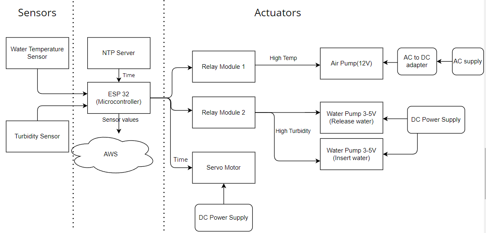

# Automated Fishpond Management using IoT and AWS 
**Microcontroller** 
ESP32-WROOM

**Sensors**
1. Turbidity sensor
2. Water temperature sensor (DS18B20)

**Actuators**
1. 2 Water pump
2. 3 Relay module
3. Air pump
4. SG90 servo motor

**Others**
1. Breadboard
2. Jumper wires
3. DC Power supply for water pump
4. AC to DC adapter for air pump
5. 4.7k ohm resistor for DS18B20 (important)
# Main functionalities
1. Automated water quality regulation
2. Automated fish feeding based on time

# Block Diagram

